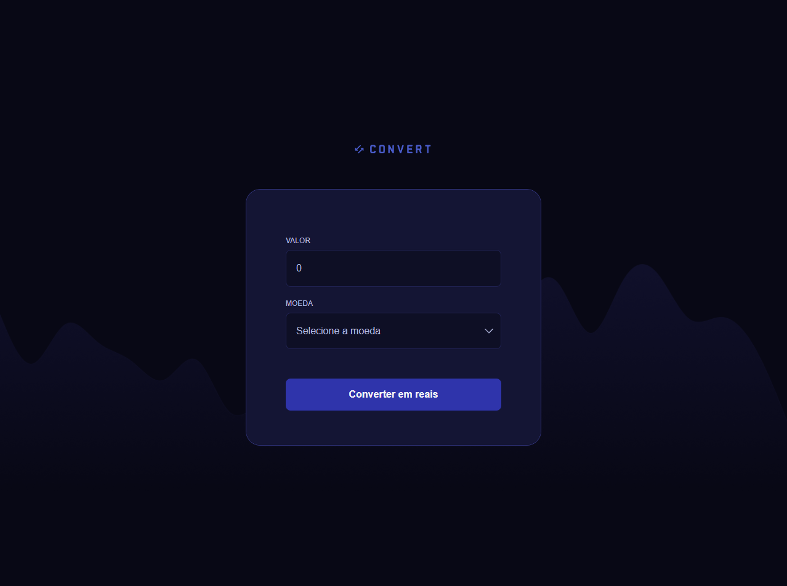

# Convert - Conversor de moedas

> Jornada Full-Stack

Convert é uma aplicação web de conversão de moedas para real.

Esse é um dos projetos desenvolvidos em aula na formação de JS.

[Clique aqui para acessar](https://pedro-k.github.io/Convert/)

## Tecnologias

- HTML
- CSS
- JavaScript
- Git e Github

pedro.kleinfelder@hotmail.com